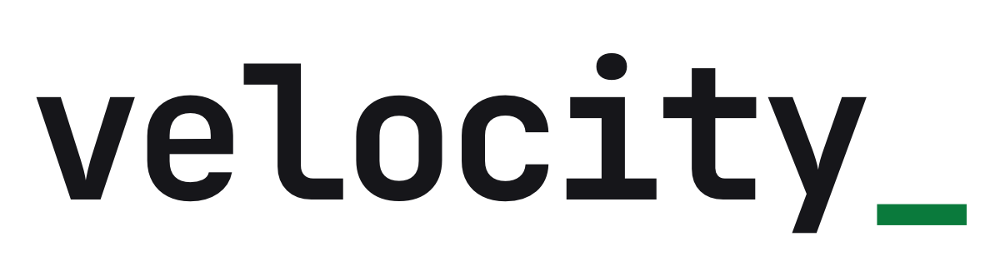

<p align="center">
  <picture>
    <source media="(prefers-color-scheme: dark)" srcset=".github/assets/logo-dark.png">
    
  </picture>
</p>

**Full-stack Go framework.**

Everything you need to build, ship, and run web applications — routing,
ORM, authentication, cache, queues, mail, storage, real-time, and more.
One binary. No external runtime. No Docker required for development.

Requires Go 1.26+.

> **Status:** Pre-1.0 (currently v0.62.x). API is still in flux — breaking
> changes may occur between minor releases. See [RELEASES.md](RELEASES.md)
> for the versioning policy and [CHANGELOG.md](CHANGELOG.md) for per-release
> breaking-change notes.

## Get Started

```bash
brew install --cask velocitykode/tap/velocity
```

```bash
velocity new myapp --stack=react && cd myapp && ./vel serve
```

Or add to an existing project:

```bash
go get github.com/velocitykode/velocity@latest
```

```go
package main

import (
    "log"

    "github.com/velocitykode/velocity"
    "github.com/velocitykode/velocity/router"
)

func main() {
    v, err := velocity.New()
    if err != nil {
        log.Fatal(err)
    }

    v.Router.Get("/", func(c *router.Context) error {
        return c.JSON(200, map[string]string{"hello": "world"})
    })

    if err := v.Serve(); err != nil {
        log.Fatal(err)
    }
}
```

### Or just one package

Every subsystem is an importable subpackage. Pull in only what you
need: you own the lifecycle, and you compile only what you import.

```go
import "github.com/velocitykode/velocity/cache"

mgr := cache.NewManager(&cache.Config{
    Default: "memory",
    Stores:  map[string]cache.StoreConfig{"memory": {Driver: cache.DriverMemory}},
})

mgr.Put("greeting", "hello", 5*time.Minute)
v, _ := mgr.Get("greeting") // "hello"
```

See [Standalone packages](https://vel.build/docs/getting-started/standalone).

For larger apps, declare bootstrap concerns up-front and chain them.
The callbacks below live in your own `app` and `routes` packages —
`velocity new` scaffolds them for you, or you can write them by hand.

```go
func main() {
    v, _ := velocity.New()

    if err := v.
        Middleware(app.Middleware(v)).      // your global/web/API middleware stacks
        Routes(routes.Register).            // your route definitions
        Events(app.Events(v.Log)).          // your event listeners
        Schedule(schedule.Configure).       // your scheduled jobs
        Exceptions(app.ExceptionHandler).   // your custom error handler
        Run(); err != nil {                 // serves HTTP, or runs a `./vel ...` command
        log.Fatal(err)
    }
}
```

## Quick Example

User signs up, validation runs, the user is saved, a job goes onto the
queue, and a typed JSON response comes back — all in one handler:

```go
v.Router.Post("/signup", func(c *router.Context) error {
    if err := c.Validate(validation.Rules{
        "email": {validation.Required(), validation.Email()},
        "name":  {validation.Required()},
    }); err != nil {
        return err // errors and old input are flashed; redirect already written
    }

    var input struct {
        Email string `json:"email"`
        Name  string `json:"name"`
    }
    if err := c.Bind(&input); err != nil {
        return c.BadRequest(err.Error())
    }

    user := models.User{Email: input.Email, Name: input.Name}
    if err := user.Save(); err != nil {
        return err
    }

    v.Queue.Push(jobs.SendWelcomeEmail{UserID: user.ID})

    return c.JSON(201, user)
})
```

Validation, ORM, queue, and router — designed to work together.

## Why Velocity

### Type-Safe ORM

Generic models return `[]User`, not `[]interface{}`. Queries are
checked at compile time. If the types don't match, it doesn't build.

```go
users, _ := User{}.Where("active = ?", true).
    OrderBy("created_at", "DESC").
    Limit(10).
    Get()
```

[Queries](https://vel.build/docs/database/queries) ·
[Relationships](https://vel.build/docs/database/relationships) ·
[Migrations](https://vel.build/docs/database/migrations)

### Swap Drivers, Not Code

Every subsystem uses pluggable drivers configured through environment
variables.

| Subsystem    | Drivers                                                  |
| ------------ | -------------------------------------------------------- |
| Database     | PostgreSQL, MySQL, SQLite                                |
| Cache        | Memory, File, Redis, Database                            |
| Queue        | Memory, Redis, Database                                  |
| Storage      | Local, S3, Memory                                        |
| Mail         | Postmark, Mailgun, Local (writes to disk)                |
| Auth         | Sessions, JWT (plus access policies on top)              |
| Broadcasting | WebSocket (additional drivers planned)                   |

SQLite in development, PostgreSQL in production. One env var:

```env
DB_CONNECTION=sqlite    # or postgres, mysql
CACHE_DRIVER=redis      # or memory, file, database
QUEUE_DRIVER=redis      # or memory, database
STORAGE_DRIVER=s3       # or local, memory
MAIL_DRIVER=postmark    # or mailgun, local, log
```

### Secure by Default

Safe defaults you opt out of, not into. Cookies ship `Secure`, `HttpOnly`,
and `SameSite=Lax`. CORS rejects every cross-origin request until you name
the origins you trust. CSRF is on for every state-changing method. The app
won't start without an `APP_KEY`, and `APP_DEBUG=true` is ignored in
production so stack traces never leak. The destructive CLI commands
(`db wipe`, `migrate fresh`, `migrate rollback`) refuse to touch a
production database unless you pass `--force`.

The lower-level pieces are conservative too:

| Area        | Default                                                                          |
| ----------- | ------------------------------------------------------------------------------- |
| Crypto      | AES-256-GCM, random nonces, constant-time compares, HKDF subkey separation      |
| Passwords   | bcrypt with an enforced cost floor                                              |
| Auth        | JWT rejects `alg=none` and algorithm substitution; session ID rotates on login  |
| Tokens      | 32-byte `crypto/rand` session and CSRF tokens                                    |
| ORM         | parameterized queries, validated identifiers, deny-by-default mass assignment    |
| Timestamps  | instants stored UTC on every write path regardless of host timezone; zones are presentation |
| Storage     | `os.Root` path containment (openat2 on Linux), no traversal or symlink escape    |
| HTTP client | SSRF guard blocks private and link-local ranges by default, TLS 1.2 floor        |

Security headers (HSTS, CSP), HTTPS redirect, and request throttling ship as
middleware you wire into the stack. Insecure modes exist, but you ask for them
by name (`InsecureAllowAllCORS`, `GRPC_INSECURE`).

### No Magic

No runtime reflection for dependency injection. No implicit model
fetching. No hidden interceptors. Every line of code does what it
says.

## What's Included

- **HTTP**: [router](https://vel.build/docs/core/http-router), [middleware](https://vel.build/docs/core/middleware), [validation](https://vel.build/docs/core/validation), [CSRF](https://vel.build/docs/core/csrf), [gRPC](https://vel.build/docs/advanced/grpc)
- **Data**: [ORM](https://vel.build/docs/database/getting-started), [cache](https://vel.build/docs/core/cache), [queues](https://vel.build/docs/advanced/queue)
- **Auth**: [schemes, access, policies](https://vel.build/docs/core/authentication)
- **Messaging**: [events](https://vel.build/docs/advanced/events), [command bus](https://vel.build/docs/advanced/bus), [notifications](https://vel.build/docs/advanced/notifications), [broadcasting](https://vel.build/docs/realtime/broadcast)
- **Frontend**: [Inertia.js adapter](https://vel.build/docs/frontend/inertia)
- **Ops**: [scheduler](https://vel.build/docs/advanced/scheduler), [encryption](https://vel.build/docs/core/crypto), [tracing](https://vel.build/docs/advanced/trace), [storage](https://vel.build/docs/advanced/storage)
- **DX**: [CLI](https://vel.build/docs/cli/commands), live reload, [test helpers](https://vel.build/docs/testing), and [string](https://vel.build/docs/core/string-utilities)/[async](https://vel.build/docs/core/async)/[pipeline](https://vel.build/docs/advanced/pipeline) helpers

Every subsystem is an importable package, usable on its own.
See [vel.build/docs](https://vel.build/docs) for the full list.

## Testing

An in-memory app harness, model factories, database refresh, a fluent HTTP
client, and fakes for events and the command bus. Refresh the schema, seed
with a factory, drive a route, then chain assertions against the response:

```go
tc := ormtesting.NewTestCase(t, manager)
tc.LazyRefreshDatabase() // migrate once, truncate per test

ormtesting.NewModelFactory[User](manager, newUser).
    State("admin").
    CreateOne(ctx, nil) // seed test data

velhttp.NewTestClient(t, router).
    ActingAs(scheme, user).
    PostJSON("/signup", map[string]any{"email": "a@b.com"}).
    AssertCreated().
    AssertJSONPath("user.email", "a@b.com")
```

Status, header, cookie, body, JSON-path, validation, and auth assertions
all chain. [Testing docs](https://vel.build/docs/testing).

## Commands

Each project builds a `./vel` binary for development and code generation.

```bash
./vel serve              # dev server with live reload
./vel build              # compile the production binary
./vel migrate            # run migrations (also fresh, rollback, status)
./vel queue work         # process queued jobs
./vel schedule work      # run the scheduler
./vel routes             # list registered routes
./vel cache clear        # flush the cache
./vel key generate       # generate the app encryption key
./vel up / ./vel down    # toggle maintenance mode
./vel gen model User     # scaffold (model, handler, job, policy, module, migration, ...)
```

Full reference: [vel.build/docs/cli/commands](https://vel.build/docs/cli/commands).

## Versioning

Velocity follows [semantic versioning](https://semver.org). Until
`v1.0.0` ships, minor versions may include breaking API changes —
always documented in [CHANGELOG.md](CHANGELOG.md) under the version's
**Breaking** section.

## Documentation

[vel.build/docs](https://vel.build/docs)

## AI-Assisted Development

[Arrow](https://vel.build/docs/ecosystem/velocity-arrow) is a Velocity-aware
MCP server that gives AI agents (Claude Code, Cursor, Codex, and more) the
context to write correct Velocity code: app info, database schema, route
listing, doc search, log reading, and config inspection, plus auto-generated
guidelines and skills matched to your project.

```bash
go install github.com/velocitykode/velocity-arrow@latest
```

[velocity-mcp](https://vel.build/docs/ecosystem/velocity-mcp) lets you rapidly
build your own MCP servers for Velocity applications, exposing tools,
resources, and prompts to AI agents.

## Community

- [GitHub Discussions](https://github.com/velocitykode/velocity/discussions)
- [Issues](https://github.com/velocitykode/velocity/issues)
- [Contributing](CONTRIBUTING.md)

## License

Velocity is open-source software licensed under the [MIT License](LICENSE).
